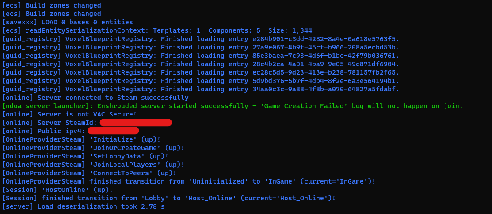

# enshrouded-server-launcher

A small python script to manage launching the Enshrouded dedicated server.

This will restart the server until it gets into a valid state where the "Game Creation Failed" bug does not happen when users attempt to connect.

Additionally, this launcher colorizes the stdout/stderr of the process for easier viewing.

# Usage
1. Install [Python](https://www.python.org/downloads/) (version 3.12 at minimum!)
2. Clone this repository
3. Modify the beginning of `run_server.py` as desired.
4. Run `py -3 run_server.py` in a command prompt.

If working correctly, you should see the server start and print the (colorized) output to the screen like such

## Discord

Interesting in making tools, reverse engineering, or working towards modding Enshrouded? Join the discord! 

https://discord.gg/Z8yqQ9EtJs